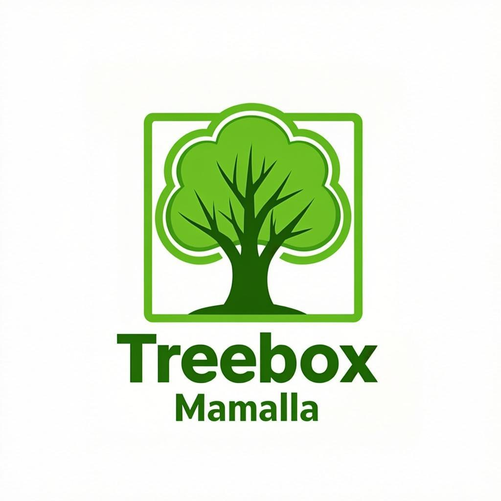

# Treebox Manila Co. — Official Website

<p align="center">
  
</p>

<p align="center">
  <strong>Premium Offset Lithography Printing Services in Metro Manila Since 1997</strong>
</p>

<p align="center">
  <a href="https://treeboxmanila.com">treeboxmanila.com</a> ·
  <a href="https://github.com/marktantongco/treeboxmanila">GitHub</a>
</p>

---

## About

Treebox Manila Co. (formerly MWC Enterprises) is a direct supplier of offset lithography printing services based in Quezon City, Metro Manila, Philippines. With over 25 years of experience, we provide custom-printed boxes, paper bags, calendars, flyers, brochures, menus, stationery, stickers, labels, and more to businesses across Metro Manila and nationwide.

This repository contains the source code for our corporate website — a modern, responsive, and animation-rich Next.js application.

---

## Tech Stack

| Category | Technology |
|----------|------------|
| **Framework** | [Next.js 16](https://nextjs.org/) (App Router + Turbopack) |
| **Language** | [TypeScript 5](https://www.typescriptlang.org/) |
| **Styling** | [Tailwind CSS 4](https://tailwindcss.com/) + CSS Custom Properties |
| **Animations** | [Framer Motion 12](https://www.framer.com/motion/) |
| **UI Components** | [shadcn/ui](https://ui.shadcn.com/) + [Radix UI](https://www.radix-ui.com/) |
| **Icons** | [Lucide React](https://lucide.dev/) |
| **Fonts** | [Inter](https://fonts.google.com/specimen/Inter) (Google Fonts) |
| **Deployment** | [Vercel](https://vercel.com/) + [GitHub Pages](https://pages.github.com/) |
| **Runtime** | [Bun](https://bun.sh/) |

---

## Project Structure

```
src/
├── app/                          # Next.js App Router pages
│   ├── layout.tsx                # Root layout (server component)
│   ├── page.tsx                  # Home page (server wrapper)
│   ├── globals.css               # Global styles + custom animations
│   ├── about/page.tsx            # About page (server wrapper)
│   ├── services/page.tsx         # Services page (server wrapper)
│   ├── contact/page.tsx          # Contact page (server wrapper)
│   ├── robots.ts                 # SEO robots.txt
│   └── sitemap.ts                # Auto-generated sitemap
│
├── components/                   # React components
│   ├── pages/                    # Client-side page content components
│   │   ├── HomePageContent.tsx
│   │   ├── AboutPageContent.tsx
│   │   ├── ServicesPageContent.tsx
│   │   └── ContactPageContent.tsx
│   │
│   ├── Header.tsx                # Sticky header with scroll progress
│   ├── Footer.tsx                # Footer with wave divider
│   ├── HeroSection.tsx           # Hero with rotating text + parallax
│   ├── StatsSection.tsx          # Animated counters + progress bars
│   ├── ServicesGrid.tsx          # Service cards with 3D reveal
│   ├── WhyChooseUs.tsx           # Why choose us with rotating icons
│   ├── ClientLogoMarquee.tsx     # Industry marquee
│   ├── ProcessSection.tsx        # 4-step process with connecting line
│   ├── Testimonials.tsx          # Testimonial carousel with swipe
│   ├── FAQ.tsx                   # Accordion FAQ
│   ├── ContactForm.tsx           # Contact form with validation
│   ├── MobileCTA.tsx             # Mobile floating CTA
│   ├── ScrollToTop.tsx           # Scroll-to-top button
│   ├── ScrollProgress.tsx        # Global scroll progress bar
│   ├── LocalBusinessSchema.tsx   # JSON-LD structured data
│   ├── FAQSchema.tsx             # FAQ structured data
│   │
│   ├── animations.tsx            # Shared animation utilities & components
│   │
│   └── ui/                       # shadcn/ui primitives
│       ├── button.tsx
│       ├── card.tsx
│       ├── sheet.tsx
│       └── ... (30+ components)
│
└── public/
    └── images/                   # Static images
        ├── treebox-logo.png
        ├── hero-printing-press.png
        └── products/             # Product category images
```

---

## Architecture Pattern

The project uses a **Server Component + Client Component split pattern**:

- **Server Components** (`app/*/page.tsx`): Handle metadata, SEO, and server-side rendering. These are the entry points for each route.
- **Client Components** (`components/pages/*Content.tsx`): Handle all interactive UI, Framer Motion animations, and user-facing logic. These are imported by server components.

This pattern ensures optimal SEO (metadata rendered server-side) while enabling rich client-side animations (Framer Motion requires client components).

---

## Animation System

The website features a comprehensive, reusable animation system built on Framer Motion, defined in `src/components/animations.tsx`.

### Core Animation Components

| Component | Description |
|-----------|-------------|
| `ScrollReveal` | Fade-up reveal with blur on scroll |
| `DirectionalReveal` | Reveal from any direction (up/down/left/right) |
| `StaggerReveal` | Staggered children reveal container |
| `StaggerGridReveal` | Grid-specific staggered reveal |
| `ImageReveal` | Image reveal with directional offset + blur |
| `HoverLiftCard` | Card lift effect on hover |
| `GlowCard` | Card with gradient glow border on hover |
| `MagneticButton` | Button that follows cursor magnetically |
| `TiltCard` | 3D tilt on mouse move |
| `AnimatedCounter` | Count-up number animation |
| `CountUp` | Spring-based count-up |
| `FloatingElement` | Gentle infinite float animation |
| `Marquee` | Infinite horizontal scroll |
| `RippleButton` | Material-style ripple on click |
| `PulseRing` | Pulsing ring effect |
| `ScrollProgress` | Scroll-based progress bar |
| `TextReveal` | Word-by-word text reveal |
| `StaggerText` | Line-by-line text reveal |
| `TypingEffect` | Typewriter effect |
| `BounceIn` | Spring bounce entrance |
| `SlideIn` | Directional slide entrance |
| `SectionHeadingReveal` | Staggered badge + title + subtitle |

### Animation Presets (Variants)

| Preset | Effect |
|--------|--------|
| `fadeInUp` | Fade up with blur |
| `fadeInDown` | Fade down with blur |
| `fadeInLeft` / `fadeInRight` | Horizontal fades with blur |
| `scaleIn` | Scale up with blur |
| `rotateIn` | Rotate + scale with blur |
| `blurIn` | Blur dissolve |
| `slideInFromBottom` | Slide up from below |
| `cardReveal3D` | 3D card reveal (blur + scale + translate) |
| `cardRevealLeft` / `cardRevealRight` | Directional card reveals |
| `fadeInUpBounce` | Fade up with spring bounce |

### Easing Curves

| Name | Value | Use Case |
|------|-------|----------|
| `EASE_OUT_EXPO` | `[0.16, 1, 0.3, 1]` | Primary easing for most animations |
| `EASE_OUT_QUINT` | `[0.22, 1, 0.36, 1]` | Secondary easing variant |
| `EASE_SPRING` | Spring physics | Bouncy, organic interactions |

### CSS Animation Classes

Defined in `globals.css`:

- `.animate-float` — Vertical float
- `.animate-morph` — Organic border-radius morphing
- `.animate-shimmer` — Shimmer sweep
- `.animate-pulse-badge` — Badge pulse ring
- `.btn-shine` — Button shine sweep on hover
- `.hover-lift` — Lift + shadow on hover
- `.hover-glow` — Green glow on hover
- `.hover-glow-amber` — Amber glow on hover
- `.gradient-border-card` — Animated gradient border
- `.spotlight-hover` — Mouse-follow spotlight

---

## Features

### SEO & Performance
- **Server-Side Rendering**: All pages are server-rendered for optimal SEO
- **JSON-LD Structured Data**: LocalBusiness and FAQ schemas for rich search results
- **Auto-generated Sitemap**: Dynamic sitemap.xml via Next.js
- **robots.txt**: Configured for full indexing
- **Open Graph + Twitter Cards**: Full social media preview support
- **Lazy Loading**: Images load on demand with Next.js Image optimization
- **Reduced Motion**: Respects `prefers-reduced-motion` accessibility setting

### Interactive Elements
- **Rotating Hero Text**: Cycles through service categories with blur transitions
- **Mouse-Follow Parallax**: Hero decorative elements respond to cursor position
- **Magnetic Buttons**: CTA buttons follow the cursor with spring physics
- **3D Tilt Cards**: Hero and about images tilt on mouse hover
- **Swipeable Testimonials**: Touch-enabled carousel with drag gestures
- **Animated Counters**: Stats count up with eased timing
- **Scroll Progress Bar**: Gradient progress bar at page top
- **Staggered Reveals**: All sections reveal with staggered entrance animations
- **Floating Decorations**: Background elements float with varied amplitudes

### Mobile Optimizations
- **Responsive Design**: Full mobile-first responsive layout
- **Mobile CTA**: Floating "Get a Quote" button on mobile
- **Swipe Gestures**: Testimonials support touch swipe navigation
- **Reduced Motion Distances**: Shorter animation distances on mobile for snappier feel
- **Scroll Snap**: Horizontal sections use mobile scroll snap
- **Touch Feedback**: Active state ripple effects for touch interactions

---

## Getting Started

### Prerequisites

- [Node.js](https://nodejs.org/) 18+ or [Bun](https://bun.sh/)
- Git

### Installation

```bash
# Clone the repository
git clone https://github.com/marktantongco/treeboxmanila.git
cd treeboxmanila

# Install dependencies
bun install

# Start development server
bun dev
```

The development server runs at `http://localhost:3000`.

### Build

```bash
# Production build
bun run build

# Start production server
bun run start
```

### Lint

```bash
bun run lint
```

---

## Deployment

### Vercel (Recommended)

The project is optimized for Vercel deployment:

1. Push to GitHub repository
2. Connect repository at [vercel.com/new](https://vercel.com/new)
3. Vercel auto-detects Next.js and deploys
4. Set environment variables if needed

### GitHub Pages

For static export to GitHub Pages:

1. Configure `next.config.ts` with `basePath` and `output: 'export'`
2. Build and deploy the `out/` directory
3. GitHub Actions workflow handles automated deployment

### Manual Deployment

```bash
# Build standalone output
bun run build

# The standalone server is at .next/standalone/
NODE_ENV=production node .next/standalone/server.js
```

---

## Environment Variables

| Variable | Description | Required |
|----------|-------------|----------|
| `AI_GATEWAY_API_KEY` | Vercel AI Gateway API key | No |

Create a `.env.local` file for local development:

```env
AI_GATEWAY_API_KEY=your_key_here
```

---

## Brand Guidelines

| Element | Value |
|---------|-------|
| **Brand Green** | `#1B5E20` |
| **Brand Green Light** | `#2E7D32` |
| **Brand Amber** | `#F57C00` |
| **Brand Amber Light** | `#FB8C00` |
| **Brand Amber Dark** | `#E65100` |
| **Brand Cream** | `#FAFAF5` |
| **Font** | Inter |
| **Border Radius** | `0.625rem` (10px) |

---

## Key Contact Information

- **Phone**: +63 2 8123 4567
- **Email**: treeboxmanila@gmail.com
- **Address**: Quezon City, Metro Manila, Philippines
- **Hours**: Monday–Saturday, 8:00 AM – 5:00 PM
- **Instagram**: [@treeboxmanila](https://www.instagram.com/treeboxmanila)
- **YouTube**: [@treeboxmanila](https://www.youtube.com/@treeboxmanila)

---

## License

Proprietary. All rights reserved by Treebox Manila Co.

---

<p align="center">
  Built with Next.js, Tailwind CSS, and Framer Motion.<br/>
  Established 1997 · Formerly MWC Enterprises · Quezon City, Metro Manila
</p>
